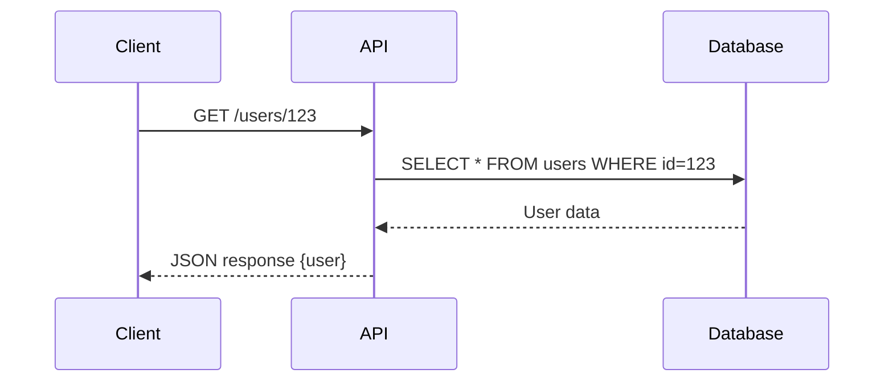
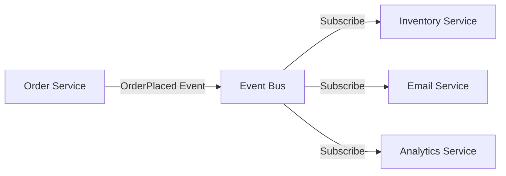
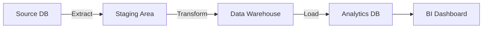
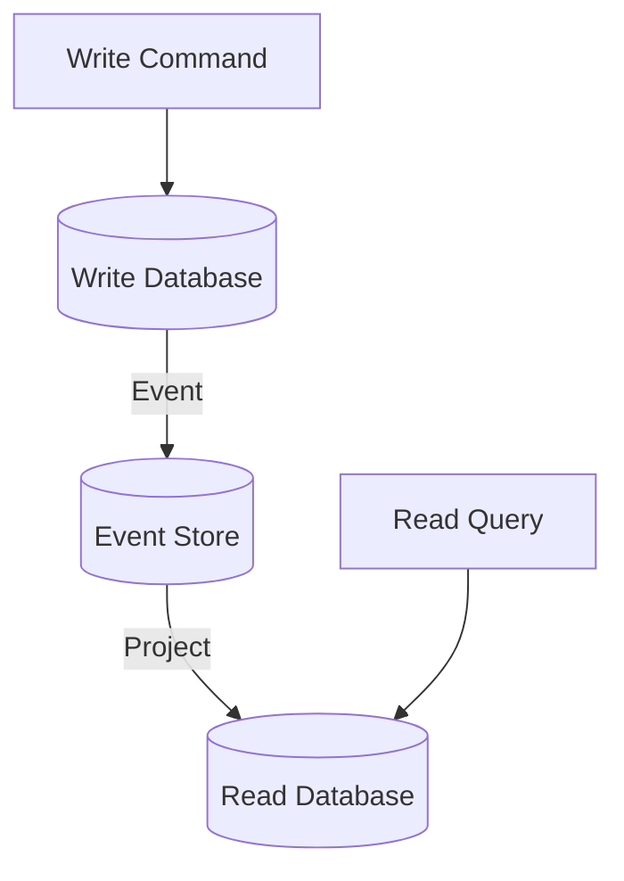
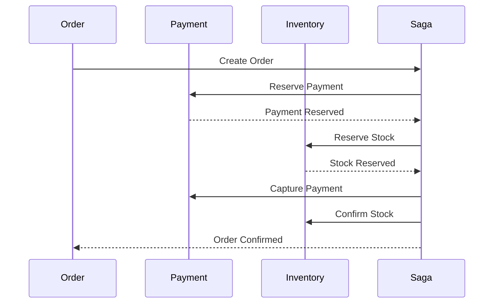

# Data Flow Patterns

Patterns for documenting and designing data flows in systems.

## Data Flow Diagram Levels

### Level 0: Context Diagram

**Purpose**: Show system boundary and external entities.

**Elements**:
- System (single box)
- External entities (users, systems)
- Data flows (arrows with labels)

**Example**:
```
[Customer] --registration data--> [Customer Portal] --confirmation email--> [Email Service]
[Customer] <--order status-- [Customer Portal] <--inventory data-- [Inventory System]
```

### Level 1: System Overview

**Purpose**: Show major processes and data stores.

**Elements**:
- Major processes (numbered bubbles/boxes)
- Data stores (databases, caches)
- External entities
- Data flows between all

### Level 2: Detailed Process

**Purpose**: Break down specific processes.

**Elements**:
- Sub-processes
- Detailed data transformations
- Internal data stores

## Common Data Flow Patterns

### Request-Response Flow

**Description**: Synchronous data exchange.

**Pattern**:
```
Client → Request → Server
Client ← Response ← Server
```

**Example Flow**:


**Characteristics**:
- Synchronous
- Client waits for response
- Direct coupling

### Event-Driven Flow

**Description**: Asynchronous event propagation.

**Pattern**:
```
Producer → Event → Event Bus → Consumer(s)
```

**Example Flow**:


**Characteristics**:
- Asynchronous
- Producer doesn't wait
- Loose coupling
- Multiple consumers

### ETL Flow (Extract-Transform-Load)

**Description**: Data pipeline for analytics.

**Pattern**:
```
Source → Extract → Transform → Load → Destination
```

**Example Flow**:


**Steps**:
1. **Extract**: Pull data from sources
2. **Transform**: Clean, enrich, aggregate
3. **Load**: Write to destination

**Use Cases**:
- Data warehousing
- Business intelligence
- Reporting
- ML training data

### CQRS Flow

**Description**: Separate read and write paths.

**Pattern**:
```
Write: Command → Write Model → Event → Read Model
Read: Query → Read Model → Response
```

**Example Flow**:


**Characteristics**:
- Optimized write model
- Optimized read model
- Eventual consistency
- Scalable independently

### Saga Pattern

**Description**: Distributed transaction across services.

**Types**:

**Choreography**:
```
Service A → Event → Service B → Event → Service C
(If failure, compensating events flow back)
```

**Orchestration**:
```
Orchestrator → Service A
Orchestrator → Service B
Orchestrator → Service C
(Orchestrator manages compensation)
```

**Example Flow**:


**Use Cases**:
- Distributed transactions
- Multi-service workflows
- Long-running processes

## Data Transformation Patterns

### Enrichment

**Description**: Add additional data to message.

**Example**:
```
Input: {user_id: 123}
Lookup: User details from database
Output: {user_id: 123, name: "John", email: "john@example.com"}
```

### Aggregation

**Description**: Combine multiple messages into one.

**Example**:
```
Input: [Order Item 1, Order Item 2, Order Item 3]
Aggregate: Sum totals
Output: {order_total: 150.00, items: 3}
```

### Splitting

**Description**: Split one message into multiple.

**Example**:
```
Input: {order_id: 1, items: [item1, item2, item3]}
Split: Create message per item
Output: [{order_id: 1, item: item1}, {order_id: 1, item: item2}, ...]
```

### Filtering

**Description**: Pass only messages matching criteria.

**Example**:
```
Input: All events
Filter: Only "OrderPlaced" events
Output: OrderPlaced events only
```

### Translation

**Description**: Convert message format.

**Example**:
```
Input: CSV row
Translate: Map to JSON
Output: {id: 1, name: "Product", price: 99.99}
```

## Data Storage Patterns

### Write-Through Cache

**Flow**:
```
Application → Write to Cache → Write to DB → Return success
```

**Characteristics**:
- Data always in cache
- Slower writes
- No stale data

### Write-Behind Cache

**Flow**:
```
Application → Write to Cache → Return success
Cache → (Async) Write to DB
```

**Characteristics**:
- Fast writes
- Risk of data loss
- Eventual consistency

### Cache-Aside (Lazy Loading)

**Flow**:
```
Application → Check Cache
If miss: Application → Load from DB → Store in Cache
If hit: Return from Cache
```

**Characteristics**:
- Data loaded on demand
- Only hot data in cache
- Cache misses on first access

### Read-Through Cache

**Flow**:
```
Application → Request from Cache
Cache → (If miss) Load from DB → Return to Application
```

**Characteristics**:
- Cache manages loading
- Simpler application logic
- First request slower

## Stream Processing Patterns

### Windowing

**Types**:
- **Tumbling**: Fixed, non-overlapping windows (0-5s, 5-10s)
- **Sliding**: Overlapping windows (0-5s, 1-6s, 2-7s)
- **Session**: Based on activity gaps

**Use Cases**:
- Real-time analytics
- Metrics aggregation
- Trend detection

### Join Patterns

**Stream-Stream Join**:
```
Stream A → [time window] ← Stream B
Output: Matched events from both streams
```

**Stream-Table Join**:
```
Stream → Lookup in Table → Enriched Stream
```

**Use Cases**:
- Correlating events
- Enriching stream data
- Complex event processing

### Deduplication

**Pattern**:
```
Events → Check seen before → Unique events only
```

**Techniques**:
- In-memory set (limited window)
- Bloom filter (probabilistic)
- Database lookup (exact)

## Data Consistency Patterns

### Strong Consistency

**Pattern**:
```
Write → Update all replicas → Confirm → Success
```

**Characteristics**:
- Immediate consistency
- Slower writes
- Lower availability

### Eventual Consistency

**Pattern**:
```
Write → Update primary → Success
Primary → (Async) Replicate to secondaries
```

**Characteristics**:
- Fast writes
- Temporary inconsistency
- Higher availability

### Causal Consistency

**Pattern**:
```
Related writes ordered, unrelated writes can be concurrent
```

**Use Cases**:
- Social media (comments after post)
- Collaborative editing

## Data Migration Patterns

### Dual Write

**Pattern**:
```
Application → Write to Old DB
Application → Write to New DB
```

**Phases**:
1. Write to both
2. Migrate existing data
3. Verify consistency
4. Switch reads to new DB
5. Stop writing to old DB

### Event Replay

**Pattern**:
```
Event Store → Replay events → New Read Model
```

**Use Cases**:
- Rebuild projections
- Migrate to new schema
- Fix data inconsistencies

## Documenting Data Flows

### Data Flow Diagram Components

**Process** (circle or rounded box):
```
[1.0 Process Name]
```

**Data Store** (open rectangle):
```
[D1 | Database Name]
```

**External Entity** (square):
```
[User]
```

**Data Flow** (arrow with label):
```
Process A --data label--> Process B
```

### Example Documentation Template

```markdown
## Data Flow: User Registration

### Overview
User registration process including validation, account creation, and email verification.

### Components
- User (external)
- Web Application (frontend)
- API Server (backend)
- User Database (PostgreSQL)
- Email Service (external)

### Flow Steps

1. **User submits registration**
   - Input: email, password, name
   - Validation: email format, password strength
   - Flow: Web App → API Server

2. **API validates and creates user**
   - Validation: email uniqueness check
   - Transform: hash password with bcrypt
   - Store: INSERT into users table
   - Flow: API Server → Database

3. **Generate verification token**
   - Generate: random UUID
   - Store: verification_tokens table with expiry
   - Flow: API Server → Database

4. **Send verification email**
   - Data: user email, verification link
   - Flow: API Server → Email Service

5. **Return success**
   - Response: 201 Created, user ID
   - Flow: API Server → Web App → User

### Error Handling
- Email already exists → 409 Conflict
- Validation failure → 400 Bad Request
- Database error → 500 Internal Server Error
- Email service down → Log error, queue for retry

### Data Transformations
- Password: plain text → bcrypt hash
- Email: normalize to lowercase
- Name: trim whitespace

### Performance Considerations
- Database: Index on email for uniqueness check
- Email: Async queue to prevent blocking
- Cache: None (write operation)
```

## Tips for Data Flow Design

1. **Start with happy path** - Document normal flow first
2. **Add error paths** - Document failure scenarios
3. **Show transformations** - Make data changes visible
4. **Identify bottlenecks** - Look for sequential dependencies
5. **Consider scale** - How does flow handle volume?
6. **Document timing** - Synchronous vs asynchronous
7. **Show data at rest** - Include storage points
8. **Use consistent notation** - Stick to one diagram style
