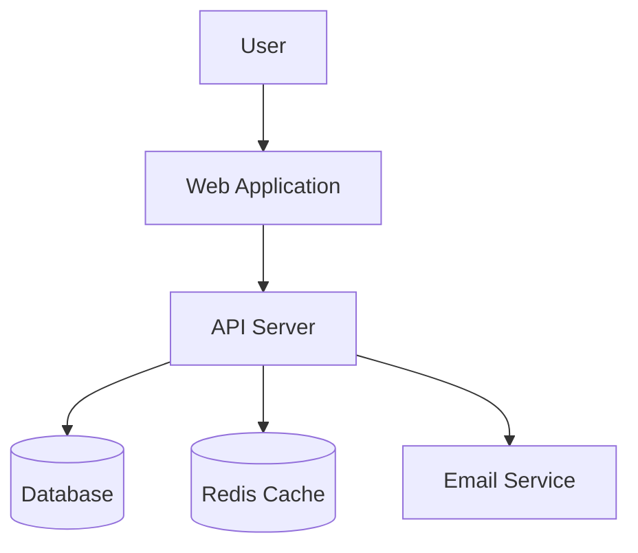
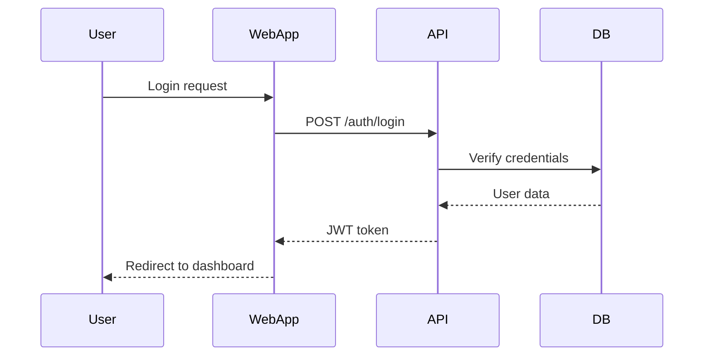

# System Design Patterns

Common architectural patterns for system design.

## Architectural Styles

### Monolithic Architecture

**Description**: Single, unified application containing all functionality.

**When to Use**:
- Small to medium applications
- Team under 10 developers
- Simple deployment requirements
- Tight coupling acceptable
- MVP or early-stage product

**Pros**:
- Simple to develop and deploy
- Easier to debug and test
- No network latency between components
- Straightforward transactions

**Cons**:
- Difficult to scale specific components
- Deployment of one change requires full redeployment
- Can become complex and hard to maintain
- Technology lock-in

### Microservices Architecture

**Description**: Application composed of small, independent services.

**When to Use**:
- Large, complex applications
- Multiple independent teams
- Need to scale components independently
- Polyglot technology requirements
- Continuous deployment needed

**Pros**:
- Independent scaling of services
- Technology flexibility per service
- Isolated failures
- Team autonomy
- Independent deployment

**Cons**:
- Operational complexity
- Network latency and reliability
- Distributed transaction complexity
- Testing complexity
- Requires strong DevOps culture

### Serverless Architecture

**Description**: Application using Function-as-a-Service and managed services.

**When to Use**:
- Event-driven applications
- Unpredictable or variable load
- Want to minimize operational overhead
- Pay-per-use pricing beneficial
- Stateless operations

**Pros**:
- No server management
- Automatic scaling
- Pay only for execution time
- High availability built-in

**Cons**:
- Cold start latency
- Vendor lock-in
- Limited execution time
- Debugging challenges
- Cost can be unpredictable at scale

## Layered Architecture Patterns

### Three-Tier Architecture

**Layers**:
1. **Presentation** (UI/Frontend)
2. **Business Logic** (Application/Backend)
3. **Data** (Database)

**Benefits**:
- Clear separation of concerns
- Each layer can be developed/deployed independently
- Easier to scale horizontally

### Hexagonal Architecture (Ports & Adapters)

**Concept**: Business logic at center, isolated from external concerns via ports and adapters.

**Structure**:
- **Core**: Business logic and domain models
- **Ports**: Interfaces defining interactions
- **Adapters**: Implementations of ports (DB, HTTP, etc.)

**Benefits**:
- Testable business logic
- Easy to swap implementations
- Framework independence

### Clean Architecture

**Layers** (inside to outside):
1. **Entities**: Core business objects
2. **Use Cases**: Application business rules
3. **Interface Adapters**: Controllers, presenters, gateways
4. **Frameworks & Drivers**: UI, DB, Web, external services

**Rule**: Dependencies point inward only.

**Benefits**:
- Framework independence
- Testable
- UI independence
- Database independence

## Communication Patterns

### Request-Response (Synchronous)

**Description**: Client sends request, waits for response.

**Protocols**: HTTP/REST, gRPC

**Use Cases**:
- User-facing operations
- Real-time data needs
- Simple CRUD operations

**Pros**:
- Simple to understand
- Immediate feedback
- Easy to debug

**Cons**:
- Coupling between services
- Timeout/failure handling complexity
- Scalability challenges

### Event-Driven (Asynchronous)

**Description**: Services communicate via events published to event bus.

**Tools**: Kafka, RabbitMQ, AWS EventBridge, Google Pub/Sub

**Use Cases**:
- Decoupled systems
- Long-running processes
- High throughput needs
- Audit logging

**Pros**:
- Loose coupling
- Scalability
- Fault tolerance
- Replay capability

**Cons**:
- Eventual consistency
- Debugging complexity
- Event versioning challenges
- Order guarantees difficult

### CQRS (Command Query Responsibility Segregation)

**Description**: Separate models for reads and writes.

**Structure**:
- **Command side**: Handles writes, optimized for updates
- **Query side**: Handles reads, optimized for queries

**Use Cases**:
- Complex read requirements
- Different scalability needs for reads/writes
- Event sourcing architectures

**Pros**:
- Optimize reads and writes independently
- Scalability
- Simplified query models

**Cons**:
- Complexity
- Eventual consistency
- Duplicate data

## Data Management Patterns

### Database per Service

**Description**: Each microservice has its own database.

**Pros**:
- Service independence
- Different databases for different needs
- Easier to scale

**Cons**:
- Distributed transactions
- Data duplication
- Complex queries across services

### Shared Database

**Description**: Multiple services share single database.

**Pros**:
- Simple transactions
- No data duplication
- Easy to query across domains

**Cons**:
- Tight coupling
- Schema changes impact all services
- Scaling challenges

### Event Sourcing

**Description**: Store all changes as sequence of events.

**Pros**:
- Complete audit trail
- Replay events to rebuild state
- Temporal queries

**Cons**:
- Complexity
- Event schema evolution
- Storage growth

## Scaling Patterns

### Load Balancing

**Types**:
- **Round Robin**: Distribute evenly
- **Least Connections**: Send to least busy
- **IP Hash**: Same client to same server
- **Weighted**: Based on server capacity

### Horizontal Scaling (Scale Out)

**Description**: Add more instances of service.

**Benefits**:
- Nearly unlimited scaling
- Fault tolerance
- No downtime scaling

**Challenges**:
- State management
- Session affinity
- Load balancing

### Vertical Scaling (Scale Up)

**Description**: Add more resources (CPU, RAM) to single instance.

**Benefits**:
- Simple
- No code changes
- No distributed system complexity

**Challenges**:
- Upper limits
- Single point of failure
- Downtime for scaling

### Caching

**Levels**:
- **Client-side**: Browser cache, local storage
- **CDN**: Edge caching for static assets
- **Application cache**: Redis, Memcached
- **Database cache**: Query cache, buffer pool

**Strategies**:
- **Cache-Aside**: App checks cache, loads on miss
- **Write-Through**: Write to cache and DB simultaneously
- **Write-Behind**: Write to cache, async to DB
- **Refresh-Ahead**: Proactively refresh hot data

## Resilience Patterns

### Circuit Breaker

**Description**: Stop calling failing service after threshold.

**States**:
- **Closed**: Normal operation
- **Open**: Stop all requests after failures
- **Half-Open**: Try limited requests to test recovery

**Benefits**:
- Fast failure
- Prevent cascade failures
- Allow service recovery

### Retry with Backoff

**Description**: Retry failed operations with increasing delays.

**Pattern**:
- Retry 1: Immediate or 1s
- Retry 2: 2s
- Retry 3: 4s
- Exponential or linear backoff

**Considerations**:
- Max retries
- Idempotency required
- Timeout limits

### Bulkhead

**Description**: Isolate resources to prevent total failure.

**Example**: Separate thread pools per service dependency.

**Benefits**:
- Failure isolation
- Resource guarantees
- Predictable degradation

### Rate Limiting

**Description**: Limit requests per time window.

**Algorithms**:
- **Fixed Window**: Count per time period
- **Sliding Window**: Rolling time window
- **Token Bucket**: Tokens refill at rate
- **Leaky Bucket**: Requests drain at rate

**Benefits**:
- Prevent overload
- Fair resource allocation
- DDoS protection

## Security Patterns

### API Gateway

**Description**: Single entry point for all client requests.

**Responsibilities**:
- Authentication/authorization
- Rate limiting
- Request routing
- Response aggregation
- Protocol translation

**Benefits**:
- Centralized security
- Simplified client
- Cross-cutting concerns in one place

### BFF (Backend for Frontend)

**Description**: Separate backend per frontend type (web, mobile, etc.).

**Benefits**:
- Optimized for specific client needs
- Independent evolution
- Security tailored to client

### OAuth 2.0 / OIDC

**Description**: Standard authorization framework.

**Flows**:
- Authorization Code (for web apps)
- Implicit (deprecated)
- Client Credentials (service-to-service)
- PKCE (mobile/SPA)

## Diagram Patterns

### C4 Model

**Levels**:
1. **Context**: System in environment with users and external systems
2. **Container**: High-level technical building blocks
3. **Component**: Components within container
4. **Code**: Class diagrams (optional)

### Mermaid Examples

**System Context**:

**Sequence Diagram**:

