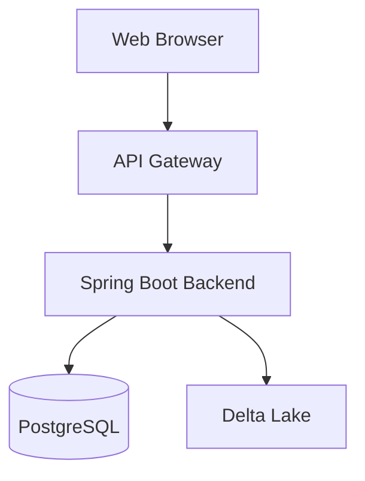
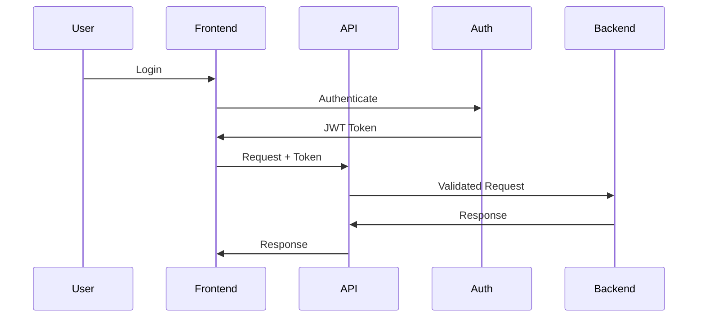
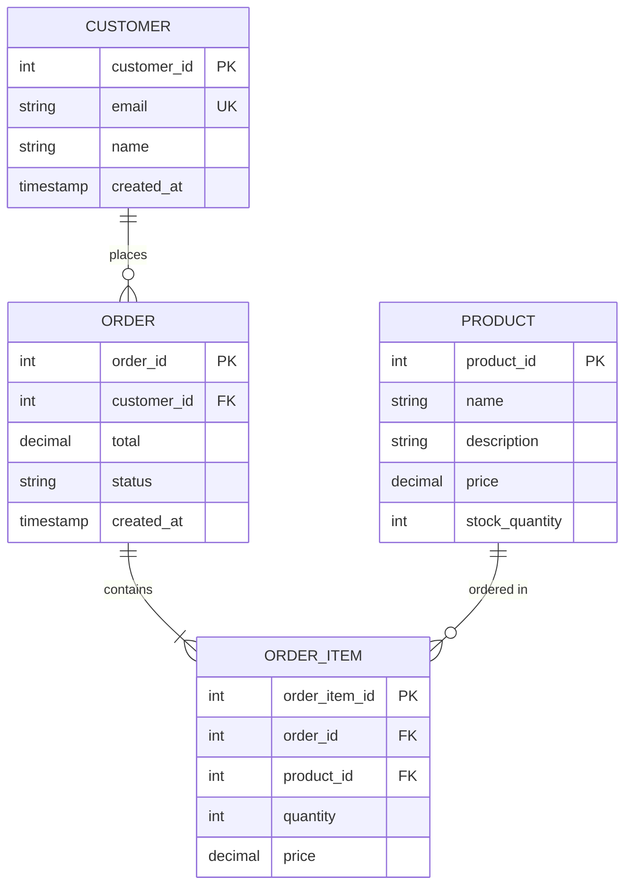

# Developer Guide Specification

Specification for generating comprehensive developer documentation.

## Directory Structure

```
docs/
  developer-guide/
    README.md
    architecture.md
    data-model.md
    api-reference.md
    adr-summary.md
    setup.md
    testing.md
    deployment.md
```

## README.md Structure

```markdown
# Developer Guide

Welcome to the [Project Name] developer documentation.

## Quick Links
- [Architecture Overview](architecture.md)
- [Data Model](data-model.md)
- [API Reference](api-reference.md)
- [Setup Instructions](setup.md)

## Project Overview
[Brief description of the project]

## Technology Stack
- **Backend:** Spring Boot, Java 17
- **Frontend:** React, TypeScript, Vite
- **Data:** Databricks, Delta Lake
- **Database:** PostgreSQL
- **Infrastructure:** Docker, Kubernetes

## Key Features
1. Feature 1
2. Feature 2
3. Feature 3
```

## architecture.md Structure

```markdown
# System Architecture

## High-Level Architecture



## Component Overview

### Frontend Layer
- React SPA with TypeScript
- Vite for build tooling
- Material-UI component library
- React Query for data fetching

### Backend Layer
- Spring Boot REST API
- JWT authentication
- Role-based authorization
- OpenAPI documentation

### Data Layer
- PostgreSQL for transactional data
- Delta Lake for analytics
- Databricks for data processing

## Design Patterns

### Backend Patterns
- Repository pattern for data access
- Service layer for business logic
- DTO pattern for API contracts
- Factory pattern for complex object creation

### Frontend Patterns
- Component composition
- Custom hooks for logic reuse
- Context for global state
- Error boundaries for error handling

## Security Architecture



## Data Flow

[Describe how data flows through the system]
```

## data-model.md Structure

```markdown
# Data Model

## Entity Relationship Diagram



## Table Specifications

### customers
Primary table for customer information.

| Column | Type | Constraints | Description |
|--------|------|-------------|-------------|
| customer_id | INT | PRIMARY KEY, AUTO_INCREMENT | Unique customer identifier |
| email | VARCHAR(255) | UNIQUE, NOT NULL | Customer email address |
| name | VARCHAR(255) | NOT NULL | Customer full name |
| created_at | TIMESTAMP | DEFAULT CURRENT_TIMESTAMP | Account creation time |

**Indexes:**
- Primary key on customer_id
- Unique index on email

### orders
[Similar structure for each table]

## Data Relationships
[Describe key relationships and constraints]
```

## api-reference.md Structure

```markdown
# API Reference

Base URL: `https://api.example.com/v1`

## Authentication
All endpoints require JWT authentication via Authorization header:
```
Authorization: Bearer <token>
```

## Endpoints

### GET /customers
Retrieve list of customers.

**Query Parameters:**
- `page` (optional): Page number (default: 1)
- `limit` (optional): Items per page (default: 20)

**Response:**
```json
{
  "data": [
    {
      "id": 1,
      "email": "user@example.com",
      "name": "John Doe",
      "createdAt": "2024-01-01T00:00:00Z"
    }
  ],
  "pagination": {
    "page": 1,
    "limit": 20,
    "total": 100
  }
}
```

**Status Codes:**
- 200: Success
- 401: Unauthorized
- 500: Server error

### POST /orders
Create a new order.

**Request Body:**
```json
{
  "customerId": 123,
  "items": [
    {
      "productId": 1,
      "quantity": 2
    }
  ]
}
```

**Response:**
```json
{
  "orderId": 456,
  "status": "pending",
  "total": 199.98
}
```

## Error Responses

All errors follow this format:
```json
{
  "error": {
    "code": "VALIDATION_ERROR",
    "message": "Invalid input",
    "details": []
  }
}
```

## Contract References
Full API contracts available in `docs/contracts/`
```

## adr-summary.md Structure

```markdown
# Architecture Decision Records Summary

## ADR-001: Use Spring Boot for Backend
**Status:** Accepted
**Date:** 2024-01-15

**Decision:** Use Spring Boot framework for backend development.

**Context:** Need robust, enterprise-ready backend framework with good ecosystem.

**Consequences:**
- Mature framework with extensive documentation
- Large community support
- Built-in security, data access, and web features

[Full ADR](../SYSTEM-DESIGN/adr/ADR-001-spring-boot.md)

## ADR-002: Use Delta Lake for Data Storage
[Similar format]
```

## setup.md Structure

```markdown
# Development Setup

## Prerequisites
- Java 17 or higher
- Node.js 18 or higher
- PostgreSQL 15
- Docker and Docker Compose

## Installation

### 1. Clone Repository
```bash
git clone https://github.com/org/project.git
cd project
```

### 2. Backend Setup
```bash
cd backend
./mvnw install
```

### 3. Frontend Setup
```bash
cd frontend
npm install
```

### 4. Database Setup
```bash
docker-compose up -d postgres
./mvnw flyway:migrate
```

### 5. Run Application
```bash
# Backend (terminal 1)
cd backend
./mvnw spring-boot:run

# Frontend (terminal 2)
cd frontend
npm run dev
```

## Environment Variables
Copy `.env.example` to `.env` and configure:
- `DATABASE_URL`: PostgreSQL connection string
- `JWT_SECRET`: Secret for JWT token signing
```
